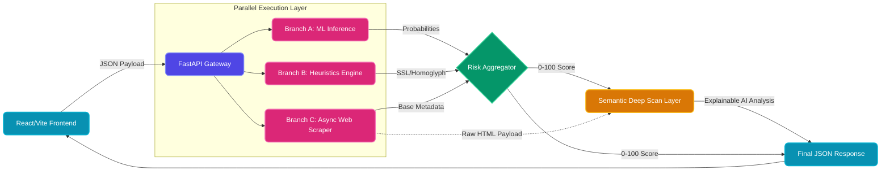

# ThreatLens

**🌐 Live Deployment:** [https://threat-lens-blue-ten.vercel.app](https://threat-lens-blue-ten.vercel.app)

ThreatLens is an advanced, dual-layer AI and heuristic threat detection system. It provides real-time risk scoring for URLs and raw emails to detect zero-day phishing, malicious indicators, and brand impersonation.

## Architecture



ThreatLens is composed of a FastAPI backend and a React/Vite frontend.

### 1. The Machine Learning Engine
- **URL Model:** XGBoost classifier trained on domain structures.
- **Email Model:** LightGBM classifier with TF-IDF vectorization for text analysis.
- The models provide an initial statistical probability of a threat in milliseconds.

### 2. The Heuristic Engine
- A deterministic rule-based engine that acts as a failsafe against ML hallucinations.
- Features Levenshtein distance calculations against 300+ global brands for typosquatting detection.
- Overrides base ML scores when definitive safe or critical signals are identified.

### 3. Asynchronous OSINT Scraper
- Automatically checks domain age, SSL validity, and threat intelligence feeds.
- Silently fetches the **raw HTML payload** of suspicious URLs in real-time.
- Fails open with a timeout: if the scraper fails or takes too long, the system degrades gracefully without hanging the user interface.

### 4. Semantic Deep Scan (Explainable AI)
- Uses **Google Gemini (Flash)** to generate concise, human-readable explanations of why a specific target was flagged.
- **URL Deep Scan:** Feeds the scraped raw HTML code into the LLM's massive context window to detect hidden credential harvesters and deceptive `<form>` actions.
- **Email Deep Scan:** Evaluates the raw text of emails for psychological manipulation and false urgency, completely bypassing standard mathematical keyword filters.

## Project Structure

- `/backend` - FastAPI server, ML models integration, HTML Scraper, and Gemini XAI logic.
- `/frontend` - React/Vite web application featuring a glassmorphic UI, dynamic SVGs, and local storage search history.
- `/models` - Pre-trained XGBoost and LightGBM models (`.pkl` files).

## Deployment Instructions

### Local Development

#### Backend
```bash
cd backend
python3 -m venv .venv
source .venv/bin/activate
pip install -r requirements.txt
# Create a .env file and add: GEMINI_API_KEY=your_key_here
uvicorn main:app --host 0.0.0.0 --port 8000
```

#### Frontend
```bash
cd frontend
npm install
npm run dev
```

